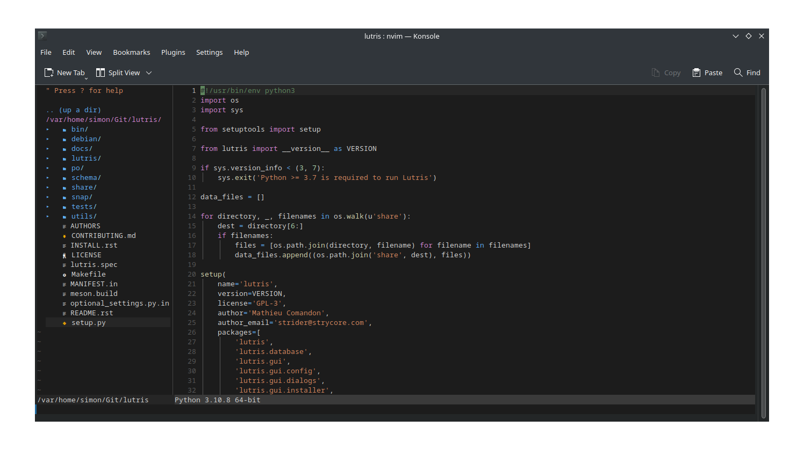
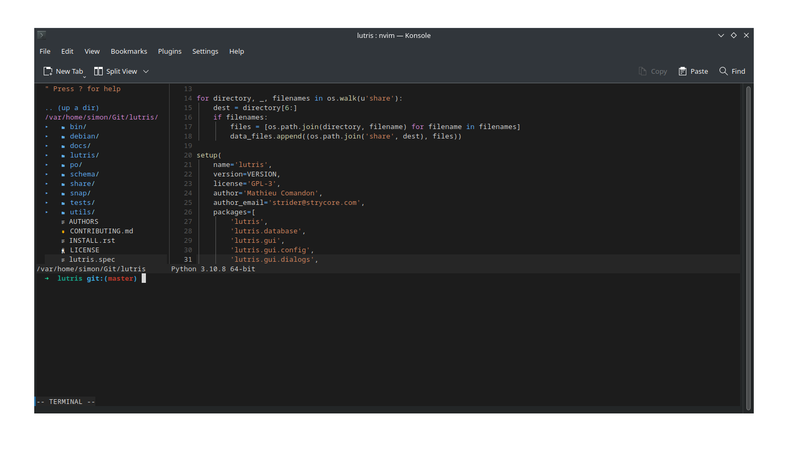

# NV-Code, Making NeoVim Looks like VSCode
This is a public repo, that contains some settings and plugins that allows you to use NeoVim like Visual Studio Code.  

# Installing
## Prerequisites
* NeoVim (Version 0.8)  
* Git  
* [NerdFonts](https://github.com/ryanoasis/nerd-fonts)  

For simple copy `neovim git`  

## Install
```
curl -sL https://raw.githubusercontent.com/sindibad363/nv-code/main/install.sh | bash
```

# Why should you use NeoVim instead of VSCode? 🤔

> If you haven't a lot of RAM and CPU available, NeoVim is a good alternative  
> NeoVim is an improved version of the traditional and famous editor Vim  
> NeoVim is an open-source text-editor, and also is a highly extensible editor  
> You can customize it by using plugins, or VimScript  
> NeoVim is very light, does not lock, its startup is fast and consumes very little resources on your machine  

## How it looks like




